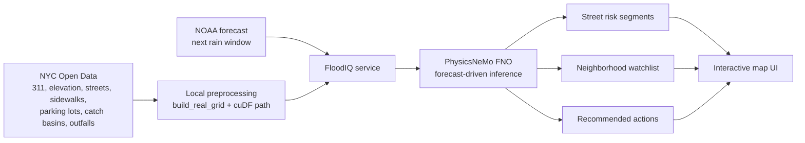

# FloodIQ

FloodIQ is a forecast-driven urban flood intelligence system for New York City. It ingests raw NYC Open Data, processes it locally, and uses NVIDIA PhysicsNeMo to predict which streets and neighborhoods are most likely to flood before rainfall begins.

The current demo focuses on clogging-prone NYC areas such as Lower Manhattan, Southeast Queens, Gowanus, East Elmhurst, and a wider Manhattan screening view.

## Quick Start

### Local CPU/dev run

```bash
python3 -m floodiq.server
```

Open [http://127.0.0.1:8000](http://127.0.0.1:8000).

### Refresh cached NYC data

```bash
python3 -m floodiq.sync_real_data
```

### Run tests

```bash
python3 -m unittest discover -s tests
```

### GN100 demo run

```bash
cd ~/FloodIQ
source .venv/bin/activate
FLOODIQ_SOLVER=physicsnemo \
python -m floodiq.server --host 0.0.0.0 --port 8010
```

If `artifacts/physicsnemo_lower_manhattan_heavy.pt` exists, FloodIQ prefers it automatically.

## Tech Stack

- Python
- NVIDIA PhysicsNeMo
- CUDA-enabled PyTorch
- RAPIDS cuDF
- NYC Open Data Socrata APIs
- NOAA weather.gov API
- Leaflet + OpenStreetMap
- Python standard-library HTTP server

## Architecture



## How To Reproduce The Demo

### Required environment

No API keys are required for the current demo. FloodIQ uses:

- public NYC Open Data APIs
- public NOAA weather.gov APIs

### Optional environment variables

Example `.env`-style values:

```bash
FLOODIQ_SOLVER=physicsnemo
FLOODIQ_PHYSICSNEMO_CHECKPOINT=artifacts/physicsnemo_lower_manhattan_heavy.pt
```

Notes:

- `FLOODIQ_SOLVER=physicsnemo` forces the PhysicsNeMo backend
- `FLOODIQ_PHYSICSNEMO_CHECKPOINT` is optional if the heavy checkpoint already exists at the default location

### Local demo flow

```bash
python3 -m floodiq.server
```

Open the app, pick a flood-prone area from the forecast board, then click `Run Latest Forecast`.

### GN100 demo flow

```bash
cd ~/FloodIQ
source .venv/bin/activate
FLOODIQ_SOLVER=physicsnemo \
python -m floodiq.server --host 0.0.0.0 --port 8010
```

If you need to force a specific checkpoint:

```bash
FLOODIQ_SOLVER=physicsnemo \
FLOODIQ_PHYSICSNEMO_CHECKPOINT=artifacts/physicsnemo_lower_manhattan_heavy.pt \
python -m floodiq.server --host 0.0.0.0 --port 8010
```

## PhysicsNeMo Training

### Default heavier training run

```bash
python3 -m floodiq.train_physicsnemo_surrogate \
  --study-area lower_manhattan \
  --samples 512 \
  --epochs 60 \
  --grid-size 128 \
  --complaint-limit 60000 \
  --elevation-limit 120000 \
  --latent-channels 48 \
  --num-fno-layers 6 \
  --num-fno-modes 16 \
  --decoder-layer-size 96 \
  --learning-rate 0.0008 \
  --output artifacts/physicsnemo_lower_manhattan_heavy.pt
```

For larger GN100 runs, see [docs/GN100_TRAINING_PLAN.md](/Users/jnanasreekonda/PycharmProjects/FloodIQ/docs/GN100_TRAINING_PLAN.md).

## Datasets And Provenance

### Real datasets used

- NYC 311 sewer complaints
  - dataset id: `erm2-nwe9`
  - source: NYC Open Data
- NYC elevation points
  - dataset id: `9uxf-ng6q`
  - source: NYC Open Data
- NYC street centerlines
  - dataset id: `inkn-q76z`
  - source: NYC Open Data
- NYC sidewalks
  - dataset id: `52n9-sdep`
  - source: NYC Open Data
- NYC parking lots
  - dataset id: `7cgt-uhhz`
  - source: NYC Open Data
- NYC catch basins
  - dataset id: `2w2g-fk3i`
  - source: NYC Open Data
- NYC outfalls
  - dataset id: `8rjn-kpsh`
  - source: NYC Open Data
- NOAA hourly / grid forecast data
  - source: [weather.gov API](https://www.weather.gov/documentation/services-web-api?prevfmt=application%2Fcap%2Bxml&prevopt=id%3DNWS-IDP-PROD-3654202-3169070)
    

## Repo Layout

- `floodiq/nyc_open_data.py`
  - pulls raw NYC Open Data layers
- `floodiq/noaa.py`
  - fetches the next rain window from NOAA
- `floodiq/real_grid.py`
  - converts real civic data into the model grid and street layers
- `floodiq/train_physicsnemo_surrogate.py`
  - trains the PhysicsNeMo FNO checkpoint
- `floodiq/solver_backends/physicsnemo_backend.py`
  - loads and runs the PhysicsNeMo checkpoint
- `floodiq/service.py`
  - orchestrates the forecast, model run, and UI payload
- `floodiq/server.py`
  - serves the local web app and JSON endpoints
- `floodiq/static/`
  - demo UI

## Known Limitations

- The current demo focuses on selected flood-prone NYC areas rather than full citywide coverage
- Nearby areas can sometimes share similar forecast patterns
- There is still room to improve map detail and flood realism

## Next Steps

1. Expand to broader Manhattan and citywide screening
2. Add richer terrain and drainage layers
3. Scale up training further on the GN100
4. Add exportable response plans for city teams
